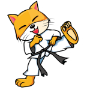

# Catmash
---

**Catmash** - это сервис позволяющий создавать и проходить голосования.

В данном проекте используются следующие технологии:

+ Spring boot
+ Spring mvc
+ Spring security
+ Hibernate
+ Thymeleaf
+ Maven
+ Postgres
+ Ajax
+ Jquery
+ Приложение тестировалось при помощи юнит-тестов
+ Были добавлены собственные CSS стили
+ Архитектра проекта основывается на MVC паттерне.

Имеются жве роли: Пользователь и Администратор. Пользователь может создавать и проходить опросы. Администратор может имеет возможность удалять опросы. 

Защита от повторного голосования реализована двумия способами (выбор способа происходит путем установления registration.enable в application.properties):

1. Фотографии за которые пользователь уже проголосовал хроняться в куки браузера (Пользователь может очистить куки и проголосовать повторно, что является существенным недостатком данного подхода (registration.enable=false))
2. Для того, чтобы проголосовать пользователю требуется пройти процесс регистрации (Информация о том какие опросы прошел пользователь хранится в базе данных (registration.enable=true))

Данный проет развернут на виртуальном сервере и вы можете ознакомиться с ним по ссылке github.com/EduardMan/Catmash

---

Содержимое файла application.properties:

+ pictures.path - путь к изображениям
+ spring.datasource.url - путь к базе данных
+ registration.enable - выбор одного из способов защиты от повторного голосования (boolean)
+ picture.max.size - максимальный размер изображения, которое пользователь может загрузить
+ pictures.min.count - минимальное количество изображений, которое пользователь может загрузить
+ pictures.max.count - максимальное количество изображений, которое пользователь может загрузить
+ mash.min.name.length - минимальная длина названия для опроса
+ mash.max.name.length - максимальая длина названия для опроса
+ mash.min.message.length - минимальная длина сообщения для опроса
+ mash.max.message.length - максимальая длина сообщения для опроса
